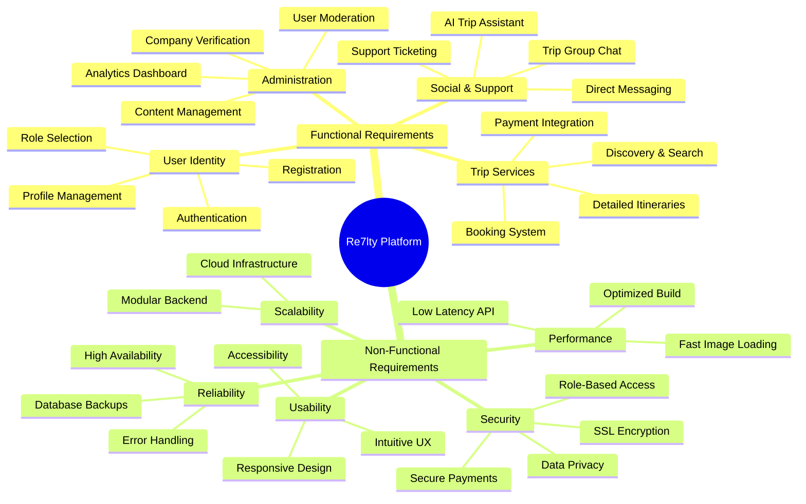

# Figure 10: Functional & Non-Functional Requirements Diagram

This document outlines the core requirements of the **Re7lty** platform, categorized into functional capabilities and non-functional quality attributes.

## Functional vs. Non-Functional Requirements

## Detailed Requirements Breakdown

### 1. Functional Requirements (FR)
| ID | Requirement | Description |
| :--- | :--- | :--- |
| **FR-01** | **Multi-Role Auth** | Support for Travelers, Company Owners, and Platform Admins. |
| **FR-02** | **Discovery Engine** | Advanced filtering and searching for diverse trip types. |
| **FR-03** | **Secure Booking** | End-to-end booking flow with verification and payment. |
| **FR-04** | **AI Assistant** | Real-time AI-powered tour guide and planning help. |
| **FR-05** | **Social Hub** | Group messaging and community networking features. |

### 2. Non-Functional Requirements (NFR)
| ID | Attribute | Target |
| :--- | :--- | :--- |
| **NFR-01** | **Performance** | Page load time under 2 seconds for core features. |
| **NFR-02** | **Scalability** | Support for up to 10,000 concurrent active users. |
| **NFR-03** | **Security** | Full compliance with modern data encryption standards (AES-256). |
| **NFR-04** | **Availability** | Target 99.9% uptime for the booking and payment services. |
| **NFR-05** | **Responsiveness** | Seamless experience across Mobile, Tablet, and Desktop. |
