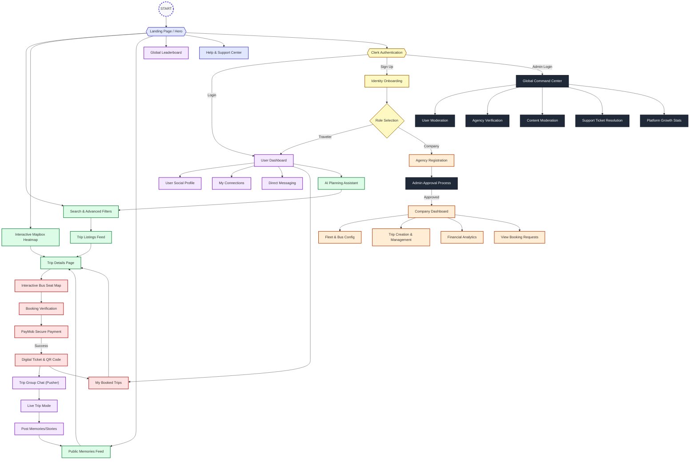

# Figure 9: User Navigation & Sitemap Flowchart

This document details the comprehensive user journey and navigation flow for the **Re7lty** platform. It maps out the relationships between different screens and the logical paths users take based on their roles, including fine-grained feature access.

## User Navigation & Sitemap Flowchart

## Key Navigation Nodes

| Node | Description | Access |
| :--- | :--- | :--- |
| **Landing Page** | The initial entry point showing featured trips and value propositions. | Public |
| **Heatmap** | Mapbox-powered visual discovery tool for regional trip density. | Public |
| **Seat Map** | Custom SVG interface for real-time bus seat selection and locking. | Authenticated |
| **AI Assistant** | Gemini-powered natural language trip recommendation engine. | Authenticated |
| **Memories Feed** | Social timeline for sharing trip stories and media via Cloudinary. | Public/Auth |
| **Company CRM** | Specialized dashboard for agencies to manage logistics and revenue. | Company |
| **Admin Center** | Central command for platform-wide moderation and dispute resolution. | Admin |

## Detailed Journey Paths

1.  **The Traveler Journey**: Landing → Heatmap → Trip Detail → AI Consultation → Seat Map → PayMob Checkout → QR Ticket → Group Chat → Story Sharing.
2.  **The Agency Journey**: Sign Up → Document Submission → Admin Review → Dashboard Access → Fleet Setup → Trip Publishing → Revenue Analytics.
3.  **The Moderator Journey**: Admin Login → Overview Dashboard → Pending Verifications → Content Moderation → Support Ticket Closing.
